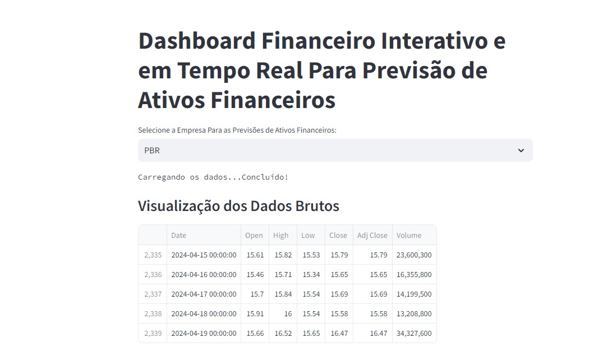
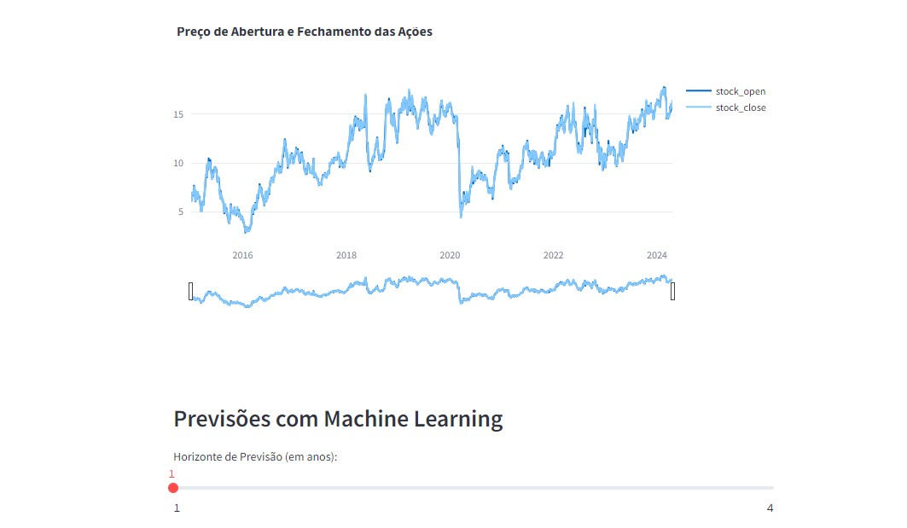
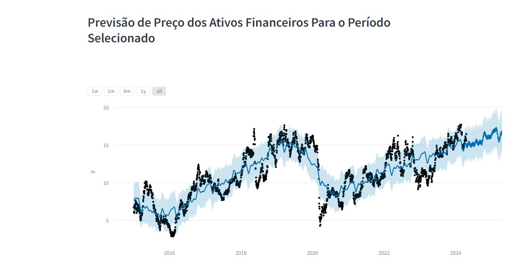

# Dashboard Finaceiro Interativo Para Previsões com Machine Learning

O objetiivo deste projeto é construir uma Data App, ou seja, uma plicação de dados que envolve gráficos interativos em um Dashboard e previsões com modelo
de Machine Learning.

  

Nossa Data App deve apresentar ao usuário os dados de cotações de ações de 4 empresas: Apple, Petrobras, Uber e Pfizer.
Além da tabela de dados, nossa Data App deve mostrar em um gráfico as cotações de abertura e fechamento das ações de 2015 aos dias atuais. Os dados de cotações de ações
podem ser extraídos em tempo real do portal Yahoo Finance.

  

Uma vez coletados os dados, nossa Data App deve ser capaz de apresentar as previsões de cotações para um horizonte de previsão de 1 a 4 anos (o usuário deve poder selecionar o
horizonte de previsão). A Data App deve mostrar os dados previstos em formato de tabela, bem como no formato de gráfico interativo.

  

Vamos construir a Data App com Linguagem Python, usando o Streamlit como biblioteca para criação da app, Prophet para criação do modelo de Machine Learning e previsão com
séries temporais e os gráficos interativos com o Plotly.

  

